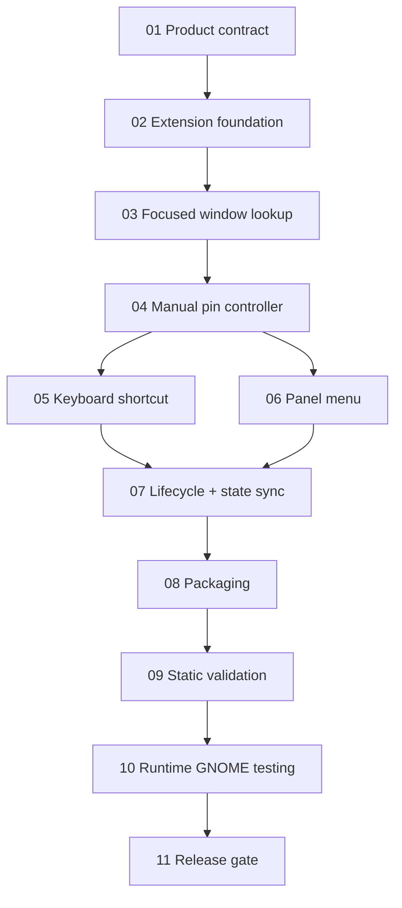

# PinIt — Implementation Checklist

## Product rule
**Nothing automatic. Every pin/unpin action must come directly from the user.**

## Dependency map

## 01 — Product contract
- [x] Manual-only behavior defined.
- [x] No auto-pin rules.
- [x] No remembered applications.
- [x] No workspace manipulation.
- [x] No opacity, snapping, or positioning.
- [x] No automatic cleanup that changes a window's pinned state.

## 02 — Extension foundation
- [x] `metadata.json`.
- [x] Minimal GSettings schema for shortcut registration.
- [x] Default shortcut: `Ctrl+Alt+P`.
- [x] GNOME 45+ ESModule structure.
- [x] No side effects during module import.

## 03 — Focused window lookup
- [x] Read focused `Meta.Window`.
- [x] Handle no focused window safely.
- [x] Generate a safe display label.
- [x] Bound/truncate long window titles.
- [x] Persist no window information.

## 04 — Manual pin controller
- [x] Read `is_above()`.
- [x] Call `make_above()` only after explicit user action.
- [x] Call `unmake_above()` only after explicit user action.
- [x] No timers, watchers, rules, or automatic pin logic.
- [x] Catch toggle errors so one bad window cannot crash the extension.

## 05 — Keyboard interaction
- [x] Register shortcut in `enable()`.
- [x] Shortcut calls the shared manual toggle controller.
- [x] Restrict shortcut to `Shell.ActionMode.NORMAL`.
- [x] Remove shortcut in `disable()`.
- [ ] Runtime-test shortcut conflict behavior on target Ubuntu.

## 06 — Panel UX
- [x] Add top-panel pin icon.
- [x] Use an icon name verified to exist in Adwaita (`view-pin-symbolic`).
- [x] Show focused-window name.
- [x] Show one Pin/Unpin action.
- [x] Disable action when no window is focused.
- [x] Update when focus changes.
- [x] Update when focused window `above` state changes externally.
- [x] No settings or automatic behavior in the menu.

## 07 — Lifecycle correctness
- [x] No runtime side effects during module import.
- [x] Disconnect focus signal.
- [x] Disconnect tracked window `notify::above` signal.
- [x] Remove keybinding.
- [x] Destroy panel UI.
- [x] Do not alter pinned/unpinned window state during extension disable.

## 08 — Packaging and install
- [x] Source install script.
- [x] Uninstall script.
- [x] ZIP packaging script.
- [x] README.
- [x] `.gitignore`.
- [x] Avoid `rsync` dependency.
- [x] Install through `gnome-extensions install --force`.
- [x] Package schema XML only; do not ship `gschemas.compiled` for GNOME 44+ flow.
- [x] Remove deprecated metadata `version` field.

## 09 — Static validation
- [x] Validate metadata JSON syntax.
- [x] Validate shell script syntax.
- [x] Validate JavaScript syntax when Node is available.
- [x] Validate package required files.
- [x] Assert package does not contain `gschemas.compiled`.
- [ ] Compile GSettings schema with `glib-compile-schemas --strict` on an environment that has GLib tools.
- [ ] Run GNOME-native package/install validation on target Ubuntu.

## 10 — Runtime Ubuntu/GNOME test
- [ ] Record `gnome-shell --version`.
- [ ] Record `echo $XDG_SESSION_TYPE`.
- [ ] Install extension.
- [ ] Log out/in if required for first discovery.
- [ ] Enable extension.
- [ ] Confirm PinIt panel icon renders correctly.
- [ ] Open two normal application windows.
- [ ] Focus A and press `Ctrl+Alt+P`.
- [ ] Confirm A stays above B.
- [ ] Press `Ctrl+Alt+P` again.
- [ ] Confirm A returns to normal.
- [ ] Repeat using panel menu.
- [ ] Change Always on Top using GNOME's native window action and confirm PinIt menu updates.
- [ ] Verify changing focus alone never pins anything.
- [ ] Verify restarting/opening an application never pins it automatically.
- [ ] Test a long window title and confirm menu stays usable.
- [ ] Test no-focus/overview transitions and confirm no Shell errors.
- [ ] Disable PinIt and confirm UI/keybinding/signal cleanup.
- [ ] Confirm disabling PinIt does not change current window state.
- [ ] Re-enable PinIt and repeat toggle.
- [ ] Inspect `journalctl` for PinIt/GJS errors.

## 11 — Compatibility matrix before release
At minimum, explicitly choose and test the versions we intend to advertise. Do not equate metadata compatibility with verified support.

- [ ] Ubuntu 24.04 / GNOME 46 (if supported).
- [ ] Current Ubuntu release / bundled GNOME version.
- [ ] Wayland session.
- [ ] Any older GNOME version retained in `metadata.json`.

## 12 — Release gate
Release only when:
- [ ] All chosen compatibility-matrix rows pass.
- [ ] No PinIt errors appear in GNOME Shell journal during normal use.
- [ ] Installation and uninstallation are repeatable.
- [ ] Final ZIP contents are reviewed manually.

## Public distribution gate
- [x] Release archive has stable name `dist/pinit.zip`.
- [x] SHA-256 release checksum generated as `dist/SHA256SUMS`.
- [x] Remote installer verifies checksum before installation.
- [x] Install/uninstall scripts derive UUID instead of hardcoding it.
- [x] GitHub tag workflow prepared to publish release assets.
- [ ] Replace development UUID with a namespace controlled by the maintainer.
- [ ] Add real public repository URL to `metadata.json`.
- [ ] Push source repository to hosting provider.
- [ ] Create first tagged release.
- [ ] Complete runtime release gate on real GNOME Shell.
- [ ] Submit tested package to extensions.gnome.org.
