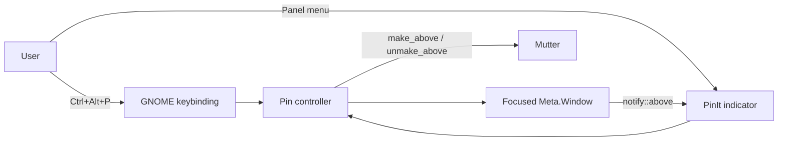

# PinIt — Product Requirements Document

## 1. Product summary
PinIt is a deliberately small GNOME Shell extension for Ubuntu Linux that lets the user manually toggle **Always on Top** for the currently focused window.

PinIt does nothing automatically. A window changes only when the user explicitly presses the shortcut or uses the panel menu.

## 2. Problem
GNOME/Mutter already supports Always on Top, but the action is not equally discoverable or convenient in every workflow. PinIt provides one obvious, consistent manual toggle.

## 3. Product principle
**Manual only.**

PinIt must never:
- auto-pin an application;
- remember applications to pin later;
- create per-app rules;
- pin windows on startup;
- move windows between workspaces;
- change opacity, size, or position;
- change a window merely because focus changed.

## 4. Goals
- Toggle Always on Top for the currently focused Mutter window.
- Use GNOME Shell/Mutter APIs directly.
- Provide one keyboard shortcut: `Ctrl+Alt+P`.
- Provide one small GNOME panel menu for mouse users.
- Keep the implementation small and easy to audit.
- Avoid background daemons, networking, telemetry, and root privileges.

## 5. Non-goals
- Automatic pinning.
- Per-application rules.
- Remembered/persistent app rules.
- Keep-on-all-workspaces behavior.
- Window opacity controls.
- Window snapping or resizing.
- Cross-desktop support.
- Shortcut preferences UI in v1.
- Notifications in v1.
- Cloud sync, accounts, telemetry, or networking.

## 6. Primary user stories
1. I focus a window and press `Ctrl+Alt+P`; it becomes Always on Top.
2. I focus that pinned window and press `Ctrl+Alt+P` again; it returns to normal stacking.
3. I can perform the same toggle manually from the PinIt panel menu.
4. If no Mutter window is focused, PinIt does nothing safely.
5. Disabling PinIt removes its UI and shortcut but does not change any window state.

## 7. Functional requirements

### FR-1 — Focused window
- Read the currently focused `Meta.Window` from GNOME Shell.
- If there is no focused window, do nothing safely.
- Do not persist window titles, classes, or IDs.

### FR-2 — Manual pin
- User action only.
- If the focused window is not above, call `make_above()`.

### FR-3 — Manual unpin
- User action only.
- If the focused window is above, call `unmake_above()`.

### FR-4 — Keyboard shortcut
- Register `Ctrl+Alt+P` while the extension is enabled.
- The shortcut calls the same toggle controller as the panel UI.
- Restrict the keybinding to normal Shell action mode.

### FR-5 — Panel menu
- Show a small pin icon in the GNOME top panel.
- Show the currently focused window name, truncated to a bounded length.
- Show one action: `Pin focused window` or `Unpin focused window`.
- Disable the action when no window is focused.
- Refresh when focus changes and when the focused window's `above` state changes.
- No behavior settings or automatic rules appear in the menu.

### FR-6 — Lifecycle
- Register keybinding, signals, and UI only in `enable()`.
- Remove keybinding, signals, and UI in `disable()`.
- Do not change any window state during `disable()`.

### FR-7 — Failure containment
- A failed Mutter toggle must not crash the extension.
- Errors may be written to the GNOME Shell journal for debugging.
- v1 does not show user notifications.

## 8. UX

```text
Focus a window
      │
      ├── Ctrl + Alt + P
      │
      └── Panel icon → Pin/Unpin focused window
                    │
                    ▼
             Is window above?
               /         \
             No           Yes
             │             │
        make_above()  unmake_above()
```

Panel menu:

```text
📌 PinIt
-------------------------
Focused: Terminal
Pin focused window
```

When the focused window is pinned:

```text
📌 PinIt
-------------------------
Focused: Terminal
Unpin focused window
```

## 9. Technical architecture



## 10. Technology
- JavaScript / GJS.
- GNOME Shell extension APIs.
- Mutter `Meta.Window`.
- GSettings only for the keybinding registration.

No Electron, Node.js runtime, native daemon, or standalone process is needed.

## 11. Supported GNOME versions
The package metadata currently targets GNOME Shell **45–50** because it uses the ESModule extension model introduced in GNOME 45 and APIs that remain present through GNOME 50.

This is a **compatibility target, not a claim that every version has been runtime-tested**. Release readiness requires testing on the Ubuntu/GNOME versions we actually intend to support.

## 12. Privacy and security
- No network access.
- No telemetry.
- No root privileges.
- No shell command execution at runtime.
- No persisted window-title history or application list.
- No background service.

## 13. Acceptance criteria
- Focus window A and press `Ctrl+Alt+P`: A becomes Always on Top.
- Press the shortcut again while A is focused: A returns to normal stacking.
- Panel action produces the same behavior.
- If the focused window's Always on Top state changes externally, PinIt's menu reflects it.
- No application is pinned without an explicit user action.
- No per-app state or auto-pin rule is stored.
- PinIt does not alter workspace membership, opacity, size, or position.
- Disabling the extension removes its keybinding, signals, and panel icon.
- Disabling PinIt does not automatically pin or unpin any window.
- The release ZIP contains source schema XML and does not ship `gschemas.compiled` for GNOME 44+ installation flow.

## 14. Release gate
PinIt v1 is **not production-ready** until all runtime checks in `IMPLEMENTATION-CHECKLIST.md` pass on at least the Ubuntu/GNOME versions chosen for release.

## 15. Future scope
Keep future versions conservative. New features should be added only if they preserve the manual-only philosophy.
